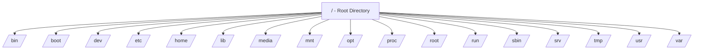

## Linux Directory Structure Explained

In this guide, we’ll explore the **Linux Directory Structure** — how files and folders are organized in Linux.  
We’ll go step by step, connecting each part so it’s easy to understand even if you’re new to Linux.

---

### 1. Introduction

In Linux, **everything is a file** — even hardware devices and system components are treated as files.

The entire system starts from a **single root directory**, represented by a **forward slash (`/`)**.

> Think of `/` as the **base of a tree**.  
> Every other directory (or file) grows from this root.

---

### 2. The Root Directory `/`

The **root directory** is the topmost directory in the Linux file system.  
All other files and directories exist **inside or under** this root.

### Example:
```
/
├── bin/
├── boot/
├── dev/
├── etc/
├── home/
├── lib/
├── media/
├── mnt/
├── opt/
├── proc/
├── root/
├── run/
├── sbin/
├── srv/
├── tmp/
├── usr/
└── var/
```

---

### 3. Visual Overview 

Here’s a simple **Mermaid diagram** to visualize the Linux directory structure:




---

### 4. Detailed Explanation of Each Directory

Let’s understand what each directory inside `/` does and why it’s important.

---

### `/bin` – Essential User Binaries
- Contains **basic command-line programs** used by all users.
- These are essential for system boot and repair.
- Commands like `ls`, `cp`, `mv`, `cat`, `grep`, `chmod`, etc., live here.

**Example:**  
```
/bin/ls       → lists files  
/bin/cp       → copies files  
/bin/mv       → moves or renames files
```

---

### `/boot` – Boot Loader Files
- Holds **files needed to boot** the operating system.
- Includes the **Linux kernel**, **initial RAM disk (initrd/initramfs)**, and **bootloader configuration** (like GRUB).

**Example:**  
```
/boot/vmlinuz      → compressed Linux kernel  
/boot/grub/        → GRUB bootloader files
```

---

### `/dev` – Device Files
- Contains **device files** that represent hardware devices.
- Linux treats devices like files — for example, a USB drive, keyboard, or hard disk.

**Example:**  
```
/dev/sda   → first hard drive  
/dev/tty   → terminal device  
/dev/null  → discards all data written to it
```

---

### `/etc` – Configuration Files
- Stores **system-wide configuration files**.
- Any settings for software or services installed system-wide go here.

**Example:**  
```
/etc/passwd    → user account information  
/etc/fstab     → disk and partition mounting info  
/etc/hostname  → system’s hostname
```

---

### `/home` – User Home Directories
- Each user gets their own **personal directory** here.
- Users store personal files, documents, and configurations.

**Example:**  
```
/home/alex/  
/home/sam/
```

> Equivalent to “Documents” or “Users” folders in Windows or macOS.

---

### `/lib` – Shared Libraries
- Contains **system libraries** required by binaries in `/bin` and `/sbin`.
- Similar to **DLL files** in Windows.

**Example:**  
```
/lib/libc.so.6   → standard C library  
/lib/modules/    → kernel modules
```

---

### `/media` – Removable Media
- Mount point for **removable drives** like USBs, CDs, DVDs.

**Example:**  
```
/media/usb  
/media/cdrom
```

---

### `/mnt` – Temporary Mount Point
- Used for **manually mounting** storage devices temporarily.
- Often used by system administrators.

**Example:**  
```
mount /dev/sdb1 /mnt
```

---

### `/opt` – Optional Software
- For installing **optional or third-party software**.
- Keeps such software separate from system files.

**Example:**  
```
/opt/google/  
/opt/zoom/
```

---

### `/proc` – Process Information
- A **virtual filesystem** that provides information about running processes and system details.
- Files here don’t actually exist on disk — they’re generated dynamically by the kernel.

**Example:**  
```
/proc/cpuinfo  → info about CPU  
/proc/meminfo  → memory details  
/proc/1234/    → details of process with PID 1234
```

---

### `/root` – Root User’s Home Directory
- This is the **home directory of the root (admin) user**.
- Different from `/` — this is specifically for the root user’s personal files.

**Example:**  
```
/root/.bashrc  
/root/scripts/
```

---

### `/run` – Runtime Data
- Contains **volatile data** that is created at runtime (since the last boot).
- Includes process IDs, sockets, and temporary runtime data.

**Example:**  
```
/run/utmp   → logged-in users info  
/run/systemd/ → systemd runtime data
```

---

### `/sbin` – System Binaries
- Contains **system administration binaries** (commands) used by the **root user**.
- These are essential for system management and repair.

**Example:**  
```
/sbin/reboot  
/sbin/fsck  
/sbin/ifconfig
```

---

### `/srv` – Service Data
- Stores data for **system services** like web servers or FTP servers.

**Example:**  
```
/srv/www/     → web server files  
/srv/ftp/     → FTP files
```

---

### `/tmp` – Temporary Files
- Used for **temporary storage** by applications and users.
- Files are deleted automatically after reboot or after a certain time.

**Example:**  
```
/tmp/tempfile123
```

---

### `/usr` – User Programs and Utilities
- Contains most of the **user-space applications**, libraries, documentation, and source code.
- Subdirectories include:
  - `/usr/bin` → user commands
  - `/usr/sbin` → admin commands
  - `/usr/lib` → libraries
  - `/usr/share` → shared data and documentation

**Example:**  
```
/usr/bin/python3  
/usr/share/man/  → manual pages
```

---

### `/var` – Variable Files
- Contains **data that changes frequently** (variable data).
- Used for logs, mail, spool files, caches, etc.

**Example:**  
```
/var/log/      → system logs  
/var/mail/     → user mailboxes  
/var/cache/    → application cache
```

---

### 5. How Directories Work Together

Each directory serves a **specific purpose**. Together, they make the Linux system **organized, modular, and efficient**.

For example:
- `/bin` + `/lib` → provide basic tools and libraries.  
- `/etc` → controls how services behave.  
- `/usr` → holds most applications users run.  
- `/var` → stores data that those applications generate.  
- `/home` → keeps user files safe and separate.

This design ensures that the **core system**, **user data**, and **applications** are neatly separated — making Linux more **secure**, **maintainable**, and **stable**.

---

### 6. Summary Table

| Directory | Purpose | Example |
|------------|----------|----------|
| `/bin` | Essential command binaries | `ls`, `cp`, `mv` |
| `/boot` | Boot files (kernel, GRUB) | `vmlinuz`, `grub.cfg` |
| `/dev` | Device files | `sda`, `tty`, `null` |
| `/etc` | Configuration files | `passwd`, `fstab` |
| `/home` | User directories | `/home/alex/` |
| `/lib` | Shared libraries | `libc.so.6` |
| `/media` | Mount for removable media | `usb`, `cdrom` |
| `/mnt` | Temporary mount point | `/mnt/usb` |
| `/opt` | Optional software | `google`, `zoom` |
| `/proc` | Process information | `cpuinfo`, `meminfo` |
| `/root` | Root user’s home | `.bashrc` |
| `/run` | Runtime data | `systemd/`, `utmp` |
| `/sbin` | System binaries | `fsck`, `reboot` |
| `/srv` | Service data | `www/`, `ftp/` |
| `/tmp` | Temporary files | `tempfile123` |
| `/usr` | User programs and libraries | `python3`, `man/` |
| `/var` | Variable data | `log/`, `cache/` |

---
