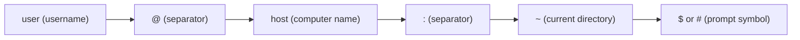

## Linux Command Line Prompt Structure and Customization

In this section, we’ll understand how the **Linux command-line prompt** works, what each part means, and how you can **customize it** using the `~/.bashrc` file.

---

### 1. Introduction to the Command Line

The **command line** (also called the **terminal** or **shell**) is a text-based interface that lets you **interact with the operating system**.

Instead of clicking icons, you **type commands** to control your system.

Most Linux distributions use a shell called **Bash** (`Bourne Again Shell`).

---

### 2. Default Command Prompt Structure

When you open a terminal in Linux, you usually see something like this:

```bash
user@host:~$
```

Let’s break it down step by step.

---

### 3. Components of the Prompt

Here’s what each part means:

| Part | Description | Example |
|------|--------------|----------|
| `user` | Your **username** (the logged-in user). | `alex` |
| `@` | Separator between username and hostname. | `@` |
| `host` | The **computer’s hostname** (system name). | `ubuntu` |
| `:` | Separator between hostname and directory path. | `:` |
| `~` | Represents your **home directory** (shortcut for `/home/username`). | `~` |
| `$` | The **prompt symbol** — indicates the type of user. | `$` or `#` |

---

### 4. The Prompt Symbols Explained

The last character of the prompt tells you what kind of user you are:

| Symbol | Meaning | Example |
|---------|----------|----------|
| `$` | **Normal user** prompt. | `alex@ubuntu:~$` |
| `#` | **Root user (administrator)** prompt. | `root@ubuntu:~#` |
| `%` | Used in some shells (like `csh` or `zsh`). | `user@macbook:~%` |

---

### 5. Visual Breakdown

Here’s a simple **Mermaid diagram** to visualize the structure of the Linux prompt:



This shows how each piece connects — forming the full prompt:  
`user@host:~$`

---

### 6. The `~` Symbol in Linux

The tilde (`~`) is a **shortcut for your home directory**.  
It expands automatically to the full path of your user’s home directory.

**Examples:**
```bash
cd ~        # goes to /home/alex
cd ~/docs   # goes to /home/alex/docs
```

---

### 7. Prompt Customization with `~/.bashrc`

The **appearance and behavior** of your prompt are controlled by **environment variables**, primarily:

- `PS1` → Primary prompt (what you see before typing a command)
- `PS2` → Secondary prompt (used when a command spans multiple lines)

These variables are defined inside your **Bash configuration file**:

```
~/.bashrc
```

---

### 8. What is `~/.bashrc`?

- It’s a **hidden configuration file** in your home directory.  
- It’s automatically executed every time you start a new terminal session.
- You can use it to:
  - Customize your **prompt**.
  - Create **aliases** (shortcuts for commands).
  - Set **environment variables**.
  - Run scripts or commands automatically when the terminal starts.

---

### 9. Customizing Your Prompt

To change your prompt, open the `~/.bashrc` file with a text editor:

```bash
nano ~/.bashrc
```

Find (or add) a line that sets the `PS1` variable, for example:

```bash
PS1="\u@\h:\w$ "
```

### Breakdown:
| Code | Meaning |
|------|----------|
| `\u` | Username |
| `\h` | Hostname |
| `\w` | Current working directory |
| `$`  | Prompt symbol (`$` or `#`) |

This will display your prompt as:

```
user@host:/current/directory$
```

---

### Example: Add Color and Style

You can add colors and styles to make your prompt more readable:

```bash
PS1="\[\033[1;32m\]\u@\h\[\033[0m\]:\[\033[1;34m\]\w\[\033[0m\]\$ "
```

- **Green** username and hostname  
- **Blue** current directory  
- **Reset** color after each section

**Output Example:**
```
alex@ubuntu:~/projects$
```

---

### 10. Apply Your Changes

After editing `.bashrc`, apply the changes without restarting your terminal by running:

```bash
source ~/.bashrc
```

---

### 11. Example `.bashrc` Section

Here’s a small section of a customized `.bashrc` file:

```bash
# ~/.bashrc - sample customization

# Custom prompt with colors
PS1="\[\033[1;32m\]\u@\h\[\033[0m\]:\[\033[1;34m\]\w\[\033[0m\]\$ "

# Useful aliases
alias ll='ls -la'
alias gs='git status'
alias update='sudo apt update && sudo apt upgrade'

# Environment variables
export EDITOR=nano
export PATH=$PATH:~/scripts
```

---

### 12. Quick Reference Table for PS1 Escape Codes

| Code | Description |
|------|--------------|
| `\u` | Username |
| `\h` | Hostname (short) |
| `\H` | Full hostname |
| `\w` | Current working directory |
| `\W` | Base name of current directory |
| `\d` | Date (weekday month day) |
| `\t` | Current time (HH:MM:SS) |
| `\@` | 12-hour time format |
| `\!` | Command number in history |
| `\$` | `$` for normal user, `#` for root |

---

### 13. Final Thoughts

The Linux command-line prompt isn’t just text — it’s **a dynamic interface** showing who you are, where you are, and what privileges you have.

By customizing it in `~/.bashrc`, you can make your terminal:
- More informative  
- More colorful  
- Tailored to your workflow

> The more you personalize your prompt, the more efficient and enjoyable your Linux experience becomes.

---
