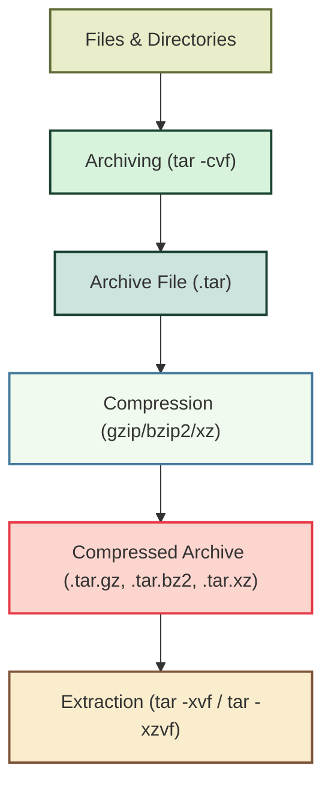

# Archiving and Compression in Linux

## 1. Understanding the Basics

### Archiving
- **Definition:** Archiving means **combining multiple files or directories into a single file** — without reducing their size.
- **Tool Used:** `tar` (stands for **Tape ARchiver**)
- **Purpose:** Simplifies storage and transfer of multiple files together.

### Compression
- **Definition:** Compression means **reducing the size** of a file or group of files.
- **Tools Used:** `gzip`, `bzip2`, `xz`, `zip`, etc.
- **Purpose:** Saves disk space and reduces transfer time.

### Combining Both
Most commonly, we use `tar` with a compression utility (like `gzip`) — creating **compressed archives** such as `.tar.gz` or `.tgz` files.

---

## 2. Creating an Archive (Without Compression)

To **archive** (but not compress), use:

```bash
tar -cvf docs_archive.tar docs/
```

**Explanation:**
- `tar` → the archiving command
- `-c` → create a new archive
- `-v` → verbose (show progress)
- `-f` → filename for the archive
- `docs_archive.tar` → the archive file to create
- `docs/` → directory to include

**Result:** A single file named `docs_archive.tar` that contains everything inside `docs/`.

---

## 3. Compressing Files

### Using `gzip`
```bash
gzip file.txt
```
**Result:** Creates `file.txt.gz` and removes the original `file.txt`.

### Decompressing
```bash
gunzip file.txt.gz
```
or
```bash
gzip -d file.txt.gz
```

---

## 4. Archiving + Compressing Together

You can combine both archiving and compression into one step using `tar` flags.

### Create a Compressed Archive
```bash
tar -czvf backup.tar.gz /home/user/document
```

**Explanation:**
- `-c` → create new archive  
- `-z` → compress with gzip  
- `-v` → verbose output  
- `-f` → specify filename  

**Result:** `backup.tar.gz` → a single compressed archive.

---

## 5. Extracting Files

### Extract from Archive (no compression)
```bash
tar -xvf docs_archive.tar
```

### Extract from Compressed Archive
```bash
tar -xzvf docs_archive.tar.gz
```

**Explanation:**
- `-x` → extract files  
- `-z` → decompress (gzip)  
- `-v` → show extraction progress  
- `-f` → filename  

---

## 6. Viewing Contents of an Archive

You can **view** the contents without extracting them:
```bash
tar -tvf backup.tar.gz
```

**Flags:**
- `-t` → list contents  
- `-v` → show detailed info  
- `-f` → specify file  

---

## 7. Using `find` with `tar`

Combine `find` and `tar` to dynamically archive files that meet certain criteria.

Example: Archive all files **modified in the last 7 days**:
```bash
find /path/to/search -type f -mtime -7 | tar -cvf recent_files.tar -T -
```

**Explanation:**
- `find` → finds all recently modified files  
- `-mtime -7` → modified in last 7 days  
- `tar -T -` → reads file list from standard input (provided by `find`)  

---

## 8. Automating Backups — Daily Backup Script

Here’s a simple **Bash script** for daily automatic backups.

```bash
#!/bin/bash
# Daily Backup Script

SOURCE_DIR="/path/to/source"
DEST_DIR="/path/to/backup"
DATE=$(date +'%Y-%m-%d')
ARCHIVE_NAME="backup-$DATE.tar.gz"

# Create a compressed tar archive
tar -czvf "$DEST_DIR/$ARCHIVE_NAME" "$SOURCE_DIR"

echo "Backup completed successfully: $DEST_DIR/$ARCHIVE_NAME"
```

### How It Works:
1. `SOURCE_DIR` → directory to back up  
2. `DEST_DIR` → location to store backups  
3. `DATE` → adds a timestamp to the archive  
4. `tar -czvf` → creates compressed archive  
5. Outputs confirmation message  

---

## 9. Common Tar Flags Summary

| Flag | Description |
|------|--------------|
| `-c` | Create archive |
| `-x` | Extract archive |
| `-t` | List contents |
| `-v` | Verbose mode |
| `-f` | Specify filename |
| `-z` | Use gzip compression |
| `-j` | Use bzip2 compression |
| `-J` | Use xz compression |

---

## 10. Real-World Examples

| Task | Command |
|------|----------|
| Create archive of `/etc` | `tar -cvf etc_backup.tar /etc` |
| Compress archive with gzip | `gzip etc_backup.tar` |
| Create compressed archive directly | `tar -czvf etc_backup.tar.gz /etc` |
| Extract a `.tar.gz` file | `tar -xzvf etc_backup.tar.gz` |
| List files in an archive | `tar -tvf etc_backup.tar.gz` |
| Archive modified files (last 2 days) | `find /var/log -mtime -2 | tar -cvf recent_logs.tar -T -` |

---

## 11. Visual Overview



---

## 12. Key Takeaways

- **Archiving** = combine multiple files into one (`tar`)  
- **Compression** = reduce size (`gzip`, `bzip2`, etc.)  
- Use `tar` with `-z` to do both at once (`.tar.gz`)  
- Always use `-v` for verbose output (to see what’s happening)  
- `find` can be combined with `tar` for dynamic backups  
- Automate backups using **Bash scripts**

---

> **Pro Tip:**  
> To ensure you never overwrite an existing backup accidentally, add:
> ```bash
> tar -czvf "$DEST_DIR/backup-$DATE.tar.gz" "$SOURCE_DIR" --exclude="$DEST_DIR"
> ```
> This ensures your backup folder itself isn’t included inside the backup!
